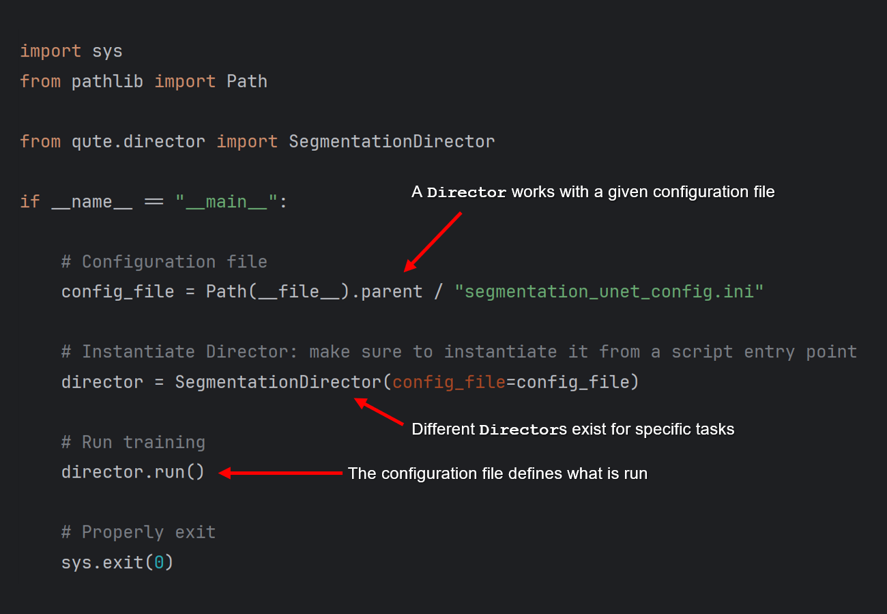

# 
Framework to support deep-learning based computer-vision research in microscopy image analysis. Leverages and extends several [PyTorch](https://pytorch.org)-based framework and tools.

* [PyTorch](https://pytorch.org)
* [PyTorch Lightning](https://www.pytorchlightning.ai/)
* [MONAI](https://monai.io)

## Installation

### Install prerequisites

* Install Miniconda from: https://docs.anaconda.com/miniconda/ (for Linux, macOS, and Windows)
* Install CUDA:
  * Linux: https://developer.nvidia.com/cuda-downloads?target_os=Linux&target_arch=x86_64
  * Windows: https://developer.nvidia.com/cuda-downloads?target_os=Windows&target_arch=x86_64
  * macOS does not support CUDA; PyTorch will use `mps` on M1 processors.

### Install qute

```bash
$ git clone https://github.com/aarpon/qute
$ cd qute
$ conda create -n qute-env python  # Minimum support version is 3.11
$ conda activate qute-env
$ pip install -e .
```

On Windows, PyTorch with CUDA acceleration has to be explicitly installed:

```bash
$ python -m pip install torch torchvision torchaudio --index-url https://download.pytorch.org/whl/cu121
```

### Test if GPU acceleration is available

* Linux and Windows:

```bash
$ python -c "import torch; print(torch.cuda.is_available())"
True
```

* macOS M1:

```bash
$ python -c "import torch; print(torch.backends.mps.is_available())"
True
```

## How to use

### High-level API

The high-level qute API provides easy to use objects that manage whole training, fine-tuning and prediction workflows following a user-defined configuration file. Configuration templates can be found in [config_samples/](config_samples/).



To get started with the high-level API, try:

```bash
$ python qute/examples/cell_segmentation_demo_unet.py
```
Configuration parameters are explained in [config_samples/](config_samples/).

To follow the training progress in [Tensorboard](https://www.tensorflow.org/tensorboard), run:

```bash
$ tensorboard --logdir ${HOME}/Documents/qute/
```
and then open TensorBoard on http://localhost:6006/.

### Low-level API

The low-level API allows easy extension of qute for research and prototyping. You can find the detailed API documentation [here](https://ia-res.ethz.ch/docs/qute/index.html).
### Hyperparameter optimization

For an example on how to use `ray[tune]` to optimize hyper-parameters, see [examples/cell_segmentation_demo_unet_hyperparameters.py](examples/cell_segmentation_demo_unet_hyperparameters.py).
